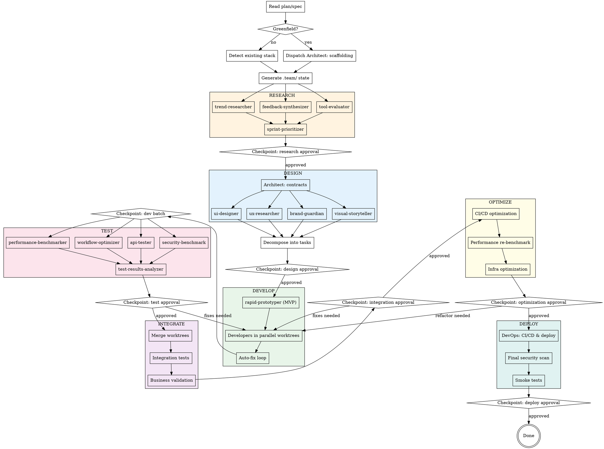

# Full Team Development Orchestrator

## Overview

Orchestrates a full development team of 20 specialized AI agents across 4 departments to develop a project in parallel. Supports web, mobile, and AI/ML projects through 8 phases from research to deployment.

### Departments

| Department | Roles | Focus |
|------------|-------|-------|
| **Engineering** (7) | architect, frontend-developer, backend-developer, mobile-app-developer, ai-engineer, devops, rapid-prototyper | Technical implementation |
| **Product** (3) | trend-researcher, feedback-synthesizer, sprint-prioritizer | Market research & prioritization |
| **Design** (4) | ui-designer, ux-researcher, brand-guardian, visual-storyteller | UI/UX & brand |
| **Testing** (6) | tool-evaluator, api-tester, workflow-optimizer, performance-benchmarker, test-results-analyzer, security-benchmark | Quality assurance |

## When to Use

- Starting development of a project that has a plan, spec, or technical document
- Parallelizing development work across backend, frontend, mobile, AI, etc.
- You want a full development lifecycle with research, design, testing, and optimization
- Building a new product and need market research + design + engineering

## Process Flow



## Invocation

The user invokes this skill by saying something like:
- "Use full-team-dev to build this project"
- "Start full team development with the plan at docs/plan.md"
- `/full-team-dev --plan docs/plan.md`

### Arguments

| Argument | Default | Description |
|----------|---------|-------------|
| `--plan` | Auto-detect in `docs/` | Path to the project plan or spec |
| `--autonomy` | `semi-autonomous` | `semi-autonomous` or `high-autonomy` |
| `--max-retries` | `3` | Max auto-fix retries before escalation |
| `--departments` | All enabled | Comma-separated departments to activate |
| `--roles` | All enabled | Comma-separated roles to activate |
| `--skip-phases` | None | Comma-separated phases to skip |

---

## Phase 1: INIT

1. **Locate the plan**: Find the plan/spec file (argument or auto-detect in `docs/`)
2. **Determine project state**:
   - Check if code already exists (look for `package.json`, `requirements.txt`, `src/`, etc.)
   - **Greenfield**: Only plan/spec exists, no code yet
   - **Existing**: Code already present, stack detectable
3. **Create `.team/` directory** in the project root with:
   - `config.json` — from template, populated with detected/configured values
   - `state.json` — from template, set phase to "init"
   - `backlog.json` — empty tasks array
   - `comms/` — empty directory for inter-agent messages
   - `reports/` — empty directory for reports
   - `artifacts/` — empty directory for design artifacts
4. **Apply argument overrides**: Update config.json based on `--departments`, `--roles`, `--autonomy`, `--max-retries`
5. **If greenfield**: Dispatch Architect agent for scaffolding:
   ```
   Agent(subagent_type="general-purpose", prompt="You are a System Architect. [skills/engineering/architect/SKILL.md content]. The project is greenfield. Read the plan at [path]. Define the technology stack, create the initial project structure, and generate base configuration files. Write your decisions to .team/reports/architecture-review.json")
   ```
6. **If existing**: Auto-detect the stack by scanning for known files (see `lib/prompts.md` for detection patterns). Populate `config.json` with detected stack info.
7. **Update state**: Set phase to "init" status "done"

---

## Phase 2: RESEARCH

**Skip if**: `--skip-phases research` or Product department disabled

1. **Dispatch 3 agents in parallel** (all in the same Agent call):
   ```
   Agent(prompt="You are a Trend Researcher. [skills/product/trend-researcher/SKILL.md]. Read the plan at [path]. Write your analysis to .team/reports/research-brief.json")

   Agent(prompt="You are a Feedback Synthesizer. [skills/product/feedback-synthesizer/SKILL.md]. Read the plan at [path]. Write your analysis to .team/reports/feedback-synthesis.json")

   Agent(prompt="You are a Tool Evaluator. [skills/testing/tool-evaluator/SKILL.md]. Read the plan at [path]. Evaluate candidate technologies. Write to .team/reports/tool-evaluation.json")
   ```

2. **After parallel agents complete**, dispatch sprint-prioritizer (sequential — needs research outputs):
   ```
   Agent(prompt="You are a Sprint Prioritizer. [skills/product/sprint-prioritizer/SKILL.md]. Read: .team/reports/research-brief.json, .team/reports/feedback-synthesis.json, .team/reports/tool-evaluation.json, and the plan. Create priority matrix. Write to .team/reports/priority-matrix.json")
   ```

3. **Checkpoint** (if semi-autonomous): Present research results to user for approval using `AskUserQuestion`:
   - Show summary of research-brief, tool-evaluation, and priority-matrix
   - Ask: approve / revise / skip to design

4. **Update state**: Set phase to "research" status "done"

---

## Phase 3: DESIGN

1. **Dispatch Architect** (sequential — contracts are foundational):
   ```
   Agent(prompt="You are a System Architect. [skills/engineering/architect/SKILL.md]. Read: plan, .team/reports/research-brief.json, .team/reports/tool-evaluation.json, .team/reports/priority-matrix.json. Define API contracts, database schemas, component interfaces. Write to .team/reports/architecture-review.json and .team/reports/contracts.json")
   ```

2. **Dispatch 4 Design agents in parallel** (after contracts exist):
   ```
   Agent(prompt="You are a UI Designer. [skills/design/ui-designer/SKILL.md]. Read: contracts.json, research-brief.json. Create design system and component specs. Write to .team/reports/design-spec.json and .team/artifacts/design-tokens.json")

   Agent(prompt="You are a UX Researcher. [skills/design/ux-researcher/SKILL.md]. Read: plan, research-brief.json, feedback-synthesis.json. Define user flows. Write to .team/reports/ux-flows.json")

   Agent(prompt="You are a Brand Guardian. [skills/design/brand-guardian/SKILL.md]. Read: plan, research-brief.json. Define brand guidelines. Write to .team/reports/brand-guidelines.json")

   Agent(prompt="You are a Visual Storyteller. [skills/design/visual-storyteller/SKILL.md]. Read: architecture-review.json, contracts.json. Create architecture diagrams. Write to .team/reports/visual-assets.json")
   ```

3. **Decompose plan into tasks**: Based on contracts, design specs, and priority matrix:
   - Break into parallelizable tasks with unique IDs (TASK-001, TASK-002, ...)
   - Assign each task a department, role, phase, priority, and dependencies
   - Identify cross-department dependencies
   - Write tasks to `.team/backlog.json`

4. **Checkpoint** (if semi-autonomous): Present architecture, design specs, and task breakdown to user for approval

5. **Update state**: Set phase to "design" status "done"

---

## Phase 4: DEVELOP

1. **Check for rapid-prototyper tasks**: If any tasks are tagged for rapid prototyping, dispatch them first:
   ```
   Agent(isolation="worktree", prompt="You are a Rapid Prototyper. [skills/engineering/rapid-prototyper/SKILL.md]. Tasks: [MVP tasks]. Contracts: [from contracts.json]. Build quick POCs. Write prototype review to .team/reports/prototype-review.json")
   ```

2. **Group remaining tasks by independence**: Identify tasks with no shared dependencies that can run in parallel

3. **Dispatch developers in parallel worktrees** — multiple agents in the same call, each role-specific:
   ```
   # For frontend tasks:
   Agent(isolation="worktree", prompt="You are a Frontend Developer. [skills/engineering/frontend-developer/SKILL.md]. Tasks: [frontend tasks]. Read: contracts.json, design-spec.json, brand-guidelines.json, ux-flows.json. Implement UI components.")

   # For backend tasks:
   Agent(isolation="worktree", prompt="You are a Backend Developer. [skills/engineering/backend-developer/SKILL.md]. Tasks: [backend tasks]. Read: contracts.json. Implement API endpoints.")

   # For mobile tasks (if enabled):
   Agent(isolation="worktree", prompt="You are a Mobile App Developer. [skills/engineering/mobile-app-developer/SKILL.md]. Tasks: [mobile tasks]. Read: contracts.json, design-spec.json. Implement mobile screens.")

   # For AI tasks (if enabled):
   Agent(isolation="worktree", prompt="You are an AI Engineer. [skills/engineering/ai-engineer/SKILL.md]. Tasks: [AI tasks]. Read: contracts.json. Implement AI integrations.")
   ```

4. **Multiple instances**: For roles with `count > 1` in config, dispatch N agents each with different tasks. Example: 2 backend-developers each with separate tasks in separate worktrees.

5. **Auto-fix loop**: When a developer reports test failures:
   - Read failure details from `.team/comms/` or agent output
   - Re-dispatch developer with failure context and incremented retry count
   - Track retries in task's `autoFixRetries` field
   - If `autoFixRetries >= maxAutoFixRetries`:
     - Escalate to Architect:
       ```
       Agent(prompt="You are a System Architect. [architect SKILL.md]. A developer has failed to fix: [failure details]. Review and propose a solution.")
       ```
     - If Architect cannot resolve: escalate to user via `AskUserQuestion`

6. **Repeat** until all tasks in current batch are done, then process next batch

7. **Update state**: Set phase to "develop" status "done"

---

## Phase 5: TEST

1. **Dispatch 5 testing agents in parallel**:
   ```
   Agent(prompt="You are an API Tester. [skills/testing/api-tester/SKILL.md]. Read contracts.json and the codebase. Run API tests. Write to .team/reports/test-results.json")

   Agent(prompt="You are a Security Benchmark specialist. [skills/testing/security-benchmark/SKILL.md]. Scan the codebase for vulnerabilities. Write to .team/reports/security-report.json")

   Agent(prompt="You are a Performance Benchmarker. [skills/testing/performance-benchmarker/SKILL.md]. Benchmark API endpoints and bundle size. Write to .team/reports/performance-report.json")

   Agent(prompt="You are a Workflow Optimizer. [skills/testing/workflow-optimizer/SKILL.md]. Analyze CI/CD and build configuration. Write to .team/reports/workflow-optimization.json")

   Agent(prompt="You are a Tool Evaluator. [skills/testing/tool-evaluator/SKILL.md]. Re-evaluate chosen tools based on development experience. Update .team/reports/tool-evaluation.json")
   ```

2. **After parallel tests complete**, dispatch test-results-analyzer (sequential):
   ```
   Agent(prompt="You are a Test Results Analyzer. [skills/testing/test-results-analyzer/SKILL.md]. Read ALL reports: test-results.json, security-report.json, performance-report.json, workflow-optimization.json. Aggregate into quality dashboard. Write to .team/reports/quality-dashboard.json")
   ```

3. **Check quality verdict**:
   - `approved` or `approved-with-warnings`: proceed to INTEGRATE
   - `changes-requested`: create fix tasks in backlog, loop back to DEVELOP
   - `blocked`: escalate to user

4. **Checkpoint** (if semi-autonomous): Present quality dashboard to user

5. **Update state**: Set phase to "test" status "done"

---

## Phase 6: INTEGRATE

1. **Merge worktrees**: Coordinate merging of all developer worktrees into the main branch
   - If merge conflicts: dispatch architect to resolve:
     ```
     Agent(prompt="You are a System Architect. [architect SKILL.md]. Resolve merge conflicts between [worktree A] and [worktree B]. Both implementations must comply with contracts.json.")
     ```

2. **Run integration tests**: Dispatch api-tester for cross-component validation:
   ```
   Agent(prompt="You are an API Tester. [api-tester SKILL.md]. Run integration tests across all merged components. Write results to .team/reports/test-results.json with phase 'integrate'")
   ```

3. **Business validation**: Dispatch sprint-prioritizer to verify requirements:
   ```
   Agent(prompt="You are a Sprint Prioritizer. [sprint-prioritizer SKILL.md]. Read: priority-matrix.json, quality-dashboard.json, and the merged code. Validate that implementations match business requirements. Write validation notes to .team/comms/")
   ```

4. **Checkpoint** (if semi-autonomous): Present integration results to user for approval
   - If fixes needed: create fix tasks, loop back to DEVELOP

5. **Update state**: Set phase to "integrate" status "done"

---

## Phase 7: OPTIMIZE

**Skip if**: `--skip-phases optimize`

1. **Dispatch 3 agents in parallel**:
   ```
   Agent(prompt="You are a Workflow Optimizer. [workflow-optimizer SKILL.md]. Read your previous analysis. Implement the top optimizations. Update .team/reports/workflow-optimization.json")

   Agent(prompt="You are a Performance Benchmarker. [performance-benchmarker SKILL.md]. Re-run benchmarks after integration. Compare with previous baselines. Update .team/reports/performance-report.json")

   Agent(prompt="You are a DevOps Engineer. [devops SKILL.md]. Read: optimization-report.json, security-report.json. Apply infrastructure optimizations: caching, CDN, compression. Update .team/reports/deployment-status.json")
   ```

2. **Checkpoint** (if semi-autonomous): Present optimization results
   - If major refactoring needed: loop back to DEVELOP

3. **Update state**: Set phase to "optimize" status "done"

---

## Phase 8: DEPLOY

1. **Dispatch 3 agents in parallel**:
   ```
   Agent(prompt="You are a DevOps Engineer. [devops SKILL.md]. Set up CI/CD pipelines, Docker configuration, and deployment scripts for [detected stack]. Write to .team/reports/deployment-status.json")

   Agent(prompt="You are a Security Benchmark specialist. [security-benchmark SKILL.md]. Run final security scan before production. Update .team/reports/security-report.json with phase 'deploy'")

   Agent(prompt="You are an API Tester. [api-tester SKILL.md]. Run smoke tests against staging environment. Write results to .team/reports/test-results.json with phase 'deploy'")
   ```

2. **Checkpoint**: **Always** require user approval before production deploy, regardless of autonomy level

3. **Update state**: Set phase to "deploy" status "done"

---

## Autonomy Levels

### Semi-Autonomous (default)
Checkpoints that require user approval:
- Research approval (Phase 2)
- Design approval (Phase 3)
- Phase completion (end of each phase)
- Test approval (Phase 5)
- Integration approval (Phase 6)
- Optimization approval (Phase 7)
- Deploy approval (Phase 8) — always required
- Conflict resolution (when agents disagree)
- Auto-fix limit exceeded

### High-Autonomy
Checkpoints that require user approval:
- Deploy approval (Phase 8) — always required
- Unresolvable blockers — when the escalation chain is exhausted

---

## Escalation Chain

```
Role (auto-fix, up to maxAutoFixRetries)
  → Department Lead:
     - Engineering: architect
     - Product: sprint-prioritizer
     - Design: ui-designer
     - Testing: test-results-analyzer
  → architect (final technical authority)
  → User (final decision via AskUserQuestion)
```

---

## State Management

The coordinator reads and updates `.team/state.json` after each significant action:

```json
{
  "version": 1,
  "currentPhase": "develop",
  "phases": {
    "init": { "status": "done", "startedAt": "...", "completedAt": "..." },
    "research": { "status": "done", "startedAt": "...", "completedAt": "..." },
    "design": { "status": "done", "startedAt": "...", "completedAt": "..." },
    "develop": { "status": "in-progress", "startedAt": "...", "completedAt": null }
  },
  "agents": [
    { "role": "backend-developer", "department": "engineering", "taskId": "TASK-003", "worktree": "full-team-eng-backend-auth", "status": "active" },
    { "role": "frontend-developer", "department": "engineering", "taskId": "TASK-007", "worktree": "full-team-eng-frontend-dashboard", "status": "active" }
  ],
  "departmentStatus": {
    "engineering": { "activeAgents": 2, "completedTasks": 5, "totalTasks": 12 },
    "product": { "activeAgents": 0, "completedTasks": 3, "totalTasks": 3 },
    "design": { "activeAgents": 0, "completedTasks": 4, "totalTasks": 4 },
    "testing": { "activeAgents": 0, "completedTasks": 0, "totalTasks": 6 }
  },
  "escalations": []
}
```

---

## Error Handling

| Error | Action |
|-------|--------|
| Agent fails to produce output | Retry once, then escalate to department lead |
| Worktree merge conflict | Dispatch architect to resolve |
| Test infrastructure broken | Dispatch devops to fix, pause testing |
| Plan is ambiguous | Ask user for clarification |
| Circular dependency in tasks | Flag to user, suggest reordering |
| Department disabled but role needed | Warn user, suggest enabling |
| All test retries exhausted | Escalate through chain: dept lead → architect → user |
| Quality gate blocked | Present blockers to user, require decision |

---

## Sub-Skills

This skill dispatches to the following sub-skills by embedding their instructions in the agent prompt:

### Engineering Department
| Sub-Skill | Role | File |
|-----------|------|------|
| `full-team-architect` | System Architect | `skills/engineering/architect/SKILL.md` |
| `full-team-frontend-developer` | Frontend Developer | `skills/engineering/frontend-developer/SKILL.md` |
| `full-team-backend-developer` | Backend Developer | `skills/engineering/backend-developer/SKILL.md` |
| `full-team-mobile-app-developer` | Mobile App Developer | `skills/engineering/mobile-app-developer/SKILL.md` |
| `full-team-ai-engineer` | AI Engineer | `skills/engineering/ai-engineer/SKILL.md` |
| `full-team-devops` | DevOps Engineer | `skills/engineering/devops/SKILL.md` |
| `full-team-rapid-prototyper` | Rapid Prototyper | `skills/engineering/rapid-prototyper/SKILL.md` |

### Product Department
| Sub-Skill | Role | File |
|-----------|------|------|
| `full-team-trend-researcher` | Trend Researcher | `skills/product/trend-researcher/SKILL.md` |
| `full-team-feedback-synthesizer` | Feedback Synthesizer | `skills/product/feedback-synthesizer/SKILL.md` |
| `full-team-sprint-prioritizer` | Sprint Prioritizer | `skills/product/sprint-prioritizer/SKILL.md` |

### Design Department
| Sub-Skill | Role | File |
|-----------|------|------|
| `full-team-ui-designer` | UI Designer | `skills/design/ui-designer/SKILL.md` |
| `full-team-ux-researcher` | UX Researcher | `skills/design/ux-researcher/SKILL.md` |
| `full-team-brand-guardian` | Brand Guardian | `skills/design/brand-guardian/SKILL.md` |
| `full-team-visual-storyteller` | Visual Storyteller | `skills/design/visual-storyteller/SKILL.md` |

### Testing Department
| Sub-Skill | Role | File |
|-----------|------|------|
| `full-team-tool-evaluator` | Tool Evaluator | `skills/testing/tool-evaluator/SKILL.md` |
| `full-team-api-tester` | API Tester | `skills/testing/api-tester/SKILL.md` |
| `full-team-workflow-optimizer` | Workflow Optimizer | `skills/testing/workflow-optimizer/SKILL.md` |
| `full-team-performance-benchmarker` | Performance Benchmarker | `skills/testing/performance-benchmarker/SKILL.md` |
| `full-team-test-results-analyzer` | Test Results Analyzer | `skills/testing/test-results-analyzer/SKILL.md` |
| `full-team-security-benchmark` | Security Benchmark | `skills/testing/security-benchmark/SKILL.md` |
